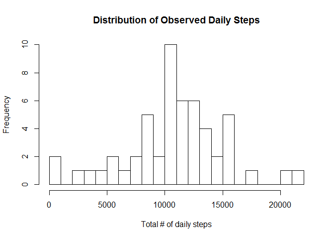

# Reproducible Research: Peer Assessment 1
Author: Steelcastle  
Date: October 14, 2015

Course: *Reproducible Research*

This file constitutes the required submission in response to [Peer Assessment 1](https://github.com/rdpeng/RepData_PeerAssessment1/blob/master/doc/instructions.pdf) 

## Loading and preprocessing the data

Begin by checking if required data file is present - if not, download zipped file and then unzip into current directory. Since this work is being performed in a Windows environment, the default download method is used. (Mac users will have to adjust their method accordingly)

```r
if(!file.exists("activity.csv")){
        url<-"https://d396qusza40orc.cloudfront.net/repdata%2Fdata%2Factivity.zip"
        download.file(url,destfile='activity.zip',mode="wb")
        unzip(zipfile="activity.zip")
}
```
The data file is in comma separated value format and is relatively small in size. Therefore the `read.csv` command will serve us adequately. Appropriate class values are assigned to each column.


```r
activitySet <- read.csv("activity.csv",colClasses=c("numeric","Date","numeric"))
```


## What is mean total number of steps taken per day?

Calculate the total # of steps for each day in the observation
data set. The `aggregate` function ignores `NA` values by default.


```r
dailyTotSteps <- aggregate(steps ~ date,FUN=sum,data=activitySet)
```

A simple histogram provides a relatively complete view of the distribution of daily steps contained in the observation data.
The number of breaks was set to 16 by running a number of iterations to produce a view with bins of width equal to 1000 steps.


```r
hist(dailyTotSteps$steps,breaks=16,main="Distribution of Observed Daily Steps",xlab="Total # of daily steps")
```

 

## What is the average daily activity pattern?


## Imputing missing values


## Are there differences in activity patterns between weekdays and weekends?
